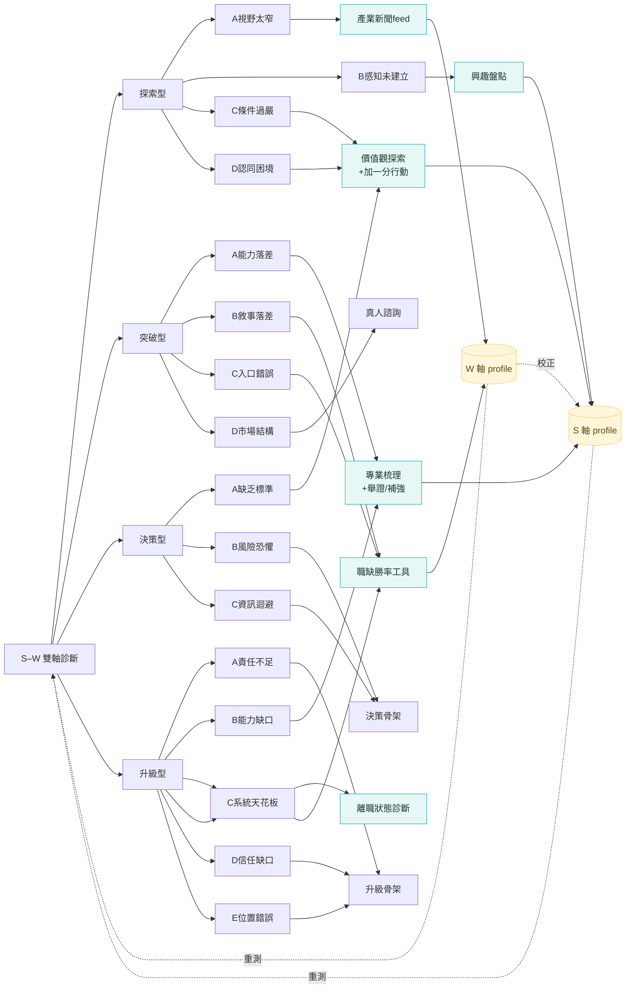

# 主關聯圖：16 卡點 × 工具 × 迴圈

> 目的：先把宏觀架構的關聯性定對，再進細節。
> 標記：狀態 🟢已建原型 / 🟡骨架設計過 / ⚪待建　｜　信心 ✅方法明確 / 🔶提案待確認

---

## 一、三條宏觀邏輯（先確認這個對不對，細節才有依據）

**邏輯 1 · 缺哪軸，補哪軸。**
卡點所在的象限，直接指出哪個軸偏低；補那個軸的工具，就是主要介入。

| 象限 | 軸況 | 主要補的軸 |
|------|------|-----------|
| 探索型 | S低 W低 | 兩軸都補（價值觀/興趣 + 職業地圖/新聞） |
| 突破型 | S高 W低 | 主補 W（職缺勝率/敘事）；勝率低再回補 S·專業 |
| 決策型 | S低 W高 | 補 S（價值觀＝判斷標準） |
| 升級型 | S高 W高 | 組織面行動為主；局部補 S·專業 / 換 W 舞台 |

**邏輯 2 · 三個工具是跨象限樞紐（一具多用，不是一卡一工具）。**
- **價值觀探索** → 探索C、探索D、決策A（都是「不知道自己要什麼」的變形）
- **專業梳理** → 突破A、升級B（都是能力面）
- **職缺勝率** → 突破B、突破C、升級C（都是市場面）

**邏輯 3 · 雙向校正。**
W 的真實回報會校正 S 的自評：突破勝率持續低 → 回 S·專業梳理；決策一直選不出 → 其實 S·價值觀沒你以為的清楚。

---

## 二、16 卡點主表

### 探索型（S低×W低｜沒有選項，需擴展視野）
| 卡點 | 核心解法方向 | 主要掛載工具 | 行動類型 | 補/建的軸 | 狀態 | 信心 |
|------|------------|------------|---------|----------|------|------|
| A 視野太窄 | 系統性看職業地圖、擴大接觸 | AI職業說明 ＋ 產業新聞feed | 探索骨架（AI先行→排序興趣→找真人） | 補 W | 🟡 | 🔶 |
| B 感知未建立 | 記錄喜歡/不喜歡、擅長/不擅長；累積真實感受與反思 | 興趣盤點 ＋ 三項測驗（DISC性格／Holland興趣／Career Anchor職業價值觀） | 最小行動體驗 ＋ 測驗核對 | 建 S·興趣（＋性格、補價值觀） | ⚪ | ✅ |
| C 條件過嚴 | 釐清優先順序、放掉非核心 | 價值觀探索（同工具，依一致性給不同引導） | 高一致→完美主義：從最重要的做加一分；低一致→外界影響：練習傾聽內在 | 建 S·價值觀 | 🟢 | ✅ |
| D 認同困境 | 分辨「外在呈現 vs 內在真需求」 | 價值觀探索（顯/潛意識落差） | 落差洞察 | 建 S·價值觀 | 🟢 | ✅ |

> **探索型備註**
> - **三項測驗（DISC／Holland／Career Anchor）**：核對性格／興趣／職業價值觀，同時補足 S·興趣 與 S·價值觀；性格＋興趣可作**長期感知核對**。
>   （實作須用原創或已授權版本，勿照抄官方版權題本。）
> - **性格＝S 軸第四子維度**（DISC）。S 軸＝價值觀／興趣／專業能力／性格，**各占 25%**，加總為「自我了解程度 %」。詳見 `measurement-model.md`。
> - **C 與 D 共用價值觀探索、但讀不同訊號**：D 看「顯/潛意識落差」分辨內外需求；C 看「一致性高/低」分辨完美主義 vs 外界影響——**工具一樣，引導語不一樣**。

### 突破型（S高×W低｜進不去市場，需調整路徑）
| 卡點 | 核心解法方向 | 主要掛載工具 | 行動類型 | 補/建的軸 | 狀態 | 信心 |
|------|------------|------------|---------|----------|------|------|
| A 能力落差 | 補硬技能 / 換低門檻入口 | 專業梳理 → 舉證/補強行動 | 補能力 | 建 S·專業 | 🟢 | ✅ |
| B 敘事落差 | 重寫經驗故事、對應具體職缺 | 職缺勝率工具 → 7天履歷改寫 | 敘事改寫 | 補 W | 🟢 | ✅ |
| C 入口錯誤 | 換切入點、側邊繞進 | 職缺勝率（①產業②職務維度）→ 入口策略 | 換入口 | 補 W | ⚪ | 🔶 |
| D 市場結構困難 | 評估是否值得 / 窄門策略 | 真人諮詢（策略判斷） | 策略判斷 | Layer 3 | ⚪ | 🔶 |

### 決策型（S低×W高｜選不出，需判斷標準）
| 卡點 | 核心解法方向 | 主要掛載工具 | 行動類型 | 補/建的軸 | 狀態 | 信心 |
|------|------------|------------|---------|----------|------|------|
| A 缺乏標準 | 建立判斷標準/權重 | 價值觀探索 → **價值觀儀表板** | 用儀表板評選項 | 建 S·價值觀 | 🟢 | ✅ |
| B 風險恐懼 | 拆解選錯代價、可逆性檢驗 | 決策骨架（可逆性） | 低代價試水 | — | 🟡 | 🔶 |
| C 資訊迴避 | 設決定截止日、直接問 | 決策骨架 | 截止日 / 直接問 | — | 🟡 | 🔶 |

### 升級型（S高×W高｜上不去，系統結構限制）
| 卡點 | 核心解法方向 | 主要掛載工具 | 行動類型 | 補/建的軸 | 狀態 | 信心 |
|------|------------|------------|---------|----------|------|------|
| A 責任不足 | 爭取小決策權 | 升級骨架（爭取決策權） | 爭取 / 曝光 | 補 組織·W | 🟡 | 🔶 |
| B 能力缺口 | 補下一層級思維模型 | 專業梳理（專業能力） | 補能力 | 建 S·專業 | 🟢 | 🔶 |
| C 系統天花板 | 換舞台 / 更大的池子 | 離職狀態診斷 ＋ 職缺勝率 | 換舞台 | 補 W | 🟢(部分) | 🔶 |
| D 信任缺口 | 先建立信任 | 升級骨架（建立信任） | 建信任 | — | ⚪ | 🔶 |
| E 位置錯誤 | 進核心專案 / 橫向移動 | 升級骨架（換位置） | 換位置 | — | ⚪ | 🔶 |

---

## 三、工具清單（每具工具服務哪些卡點、建哪個軸）

| 工具 | 角色 | 服務的卡點 | 建/補的軸 | 狀態 |
|------|------|-----------|----------|------|
| S–W 雙軸診斷 | 入口：定位四象限＋主次卡點 | 全部 | — | 🟢 (網站測驗) |
| 離職狀態診斷 | **入口B（情境前門）＋ 6型路由器**：該不該走 / 何時走 / 怎麼走 | 全象限（依6型分流，見 §六之二） | 部分回補 W | 既有 |
| 價值觀探索 ＋ 加一分行動 | S·價值觀；產出價值觀儀表板 | 探索C、探索D、決策A、（離職:心累型） | 建 S·價值觀 | 🟢 |
| 興趣盤點 | S·興趣（持續/中斷的興趣） | 探索B、（離職:職務不合型） | 建 S·興趣 | ⚪ |
| 三項標準測驗（DISC／Holland／Career Anchor） | 核對性格／興趣／職業價值觀；長期感知核對 | 探索B（並補 興趣、價值觀） | 建 S·性格、興趣；補 價值觀 | ⚪ |
| 專業梳理 ＋ 舉證/補強行動 | S·專業（兩個篩子→三類資產） | 突破A、升級B、（離職:籌碼不夠型） | 建 S·專業 | 🟢 |
| 職缺勝率工具（三維13分） | W·市場匹配；五向分流 | 突破B、突破C、升級C、（離職:環境/卡關型） | 補 W | 🟢 |
| 7天行動骨架（通用模板） | 各卡點的 Loop A 執行層 | 各卡點 | — | 🟡 |
| 薪資談判力診斷（7維/4型） | **成果兌現階段**：offer談薪 / 在職加薪 / 跳槽議價 | 突破型(offer後)、升級型(加薪/被低估)、換舞台 | — | 既有 |
| 產業新聞推薦（讀完打勾） | W軸長期回補 | 探索A、探索B | 補 W·市場認知 | ⚪ |

---

## 四、三條迴圈如何套在 16 卡點上

- **Loop A（縱深·短期）**：每個卡點一條 → 診斷 → 解法方向（pathLib）→ 工具/7天骨架 → 完成。
- **Loop B（回補·長期）**：工具產出 → 回補 profile，並計為「自我了解 %／世界認知 %」（量表見 `measurement-model.md`）：
  - **S 軸＝自我了解（4 維各 25%）**：價值觀／興趣／專業能力／性格 ←（排序與分數、Holland、專業三類資產、DISC）
  - **W 軸＝世界認知（3 維）**：職業／產業／趨勢 ←（職業蒐集深度、產業涵蓋、趨勢產出與連結）
  - S 不衰減；**W 會衰減**（市場會過時）→ 久未維護就降，自然驅動回訪。
  - → 重測看成長、看象限位移 → **訂閱引擎**。
- **W↔S 校正（雙向）**：W 真實回報 ⇄ S 自評互相修正（突破勝率低→S專業；決策選不出→S價值觀）。

---

## 五、宏觀關係圖



---

## 六之一、兩條工具軸線（看懂整個工具庫）

把 9 個工具分成兩軸，整個系統就清楚了：

- **S 軸 · 知己工具**（理解自己）：價值觀探索、興趣盤點、專業梳理
- **W 軸 · 行動工具**（沿求職時間軸）：**離職診斷（離開）→ 職缺勝率（投遞）→ 薪資談判（談薪/兌現）**

三支情境工具不是各自獨立，而是同一條行動時間軸上的三站：要不要走 → 投得上嗎 → 拿到後怎麼談。

---

## 六之二、情境工具定位（已確認）

### A. 離職狀態診斷 = 入口 B ＋ 6 型路由器（已確認用「入口＋路由」）
- **功能**：6 維滑桿（身心內耗/職務適配/成長感/文化契合/環境人際/離職準備度）＋ 衝動×準備 2×2 矩陣 ＋ 7-30-90 行動 ＋ 離職信。
- **定位**：情緒性「想離職」者的前門；**衝動×準備矩陣＝退場時機 gate**（準備低→先別裸辭，去 W 軸補籌碼）。
- **6 型路由（確認版）**：

| 離職狀態類型 | 路由去向 |
|---|---|
| 心累燃燒殆盡型 | 先穩身心 → **價值觀排序與分數 ＋ 加一分行動**（逐步提升自信、穩定身心） |
| 原地踏步卡關型 | 升級型卡點 / 職缺勝率（成長、換舞台） |
| 道不同不相為謀型 | S·價值觀維度（價值衝突） |
| 職務八字不合型 | S·興趣維度 / 探索型（職務與興趣脫節） |
| 職場環境水土不服型 | 換環境（同職缺不同公司）→ 職缺勝率 |
| 籌碼還沒存夠型 | W 軸準備（專業梳理 ＋ 職缺勝率 ＋ 存款） |

> 原工具結尾只導向真人諮詢；整合後改成**先依 6 型路由進對應模組**，真人為最後出口。

### B. 職缺勝率分析器 = W·投遞階段引擎（已確認，突破型B原型已實作）
- 三維 13 分（產業關係1-4／職務重疊1-4／條件符合1-5），AI 引擎＋本地關鍵字引擎雙保險。
- 五向分流：**≤6** 調整目標／回 S 專業；**7–9** 履歷敘事改寫（黃金區）；**10–13** 問題在別處；**③=5** 大材小用；**③≤2** 條件落差。
- 服務 突破B/C、升級C，並接住離職診斷的「環境型／卡關型」。

### C. 薪資談判力診斷 = W·成果兌現階段（已確認）
- **功能**：7 維（市場資訊／成果說服力／替代選項BATNA／薪資結構／開口舒適／時機／稀缺性）＋ 場景(offer/raise/undervalued/structure/jobhop) ＋ 薪資落差精算 ＋ 4 型 ＋ 實戰金句 ＋ 推薦閱讀。
- **4 型**：先別硬談(≤40) / 準備不足(≤60) / 可以試探(≤80) / 高底氣(>80)。
- **定位**：接在「**拿到機會之後**」——突破型 offer 端、升級型加薪/被低估、跳槽議價。是行動時間軸的最後一站。
- **跨接**：低分（先別硬談/準備不足）常因「成果說服力」「市場資訊」不足 → 回補 **S·專業（舉證）** 與 **W·職缺勝率**。

---

## 六之三、整合後的行動時間軸

```
[入口A 想釐清生涯] ─┐
                    ├→ S–W 雙軸定位 → 卡點 → 對應工具 → 行動 → 回補
[入口B 我想離職]──→ 離職診斷(6型路由) ─┘                          │
                                                                  ▼
   求職時間軸：  離職診斷(離開) → 職缺勝率(投遞) → 薪資談判(談薪/兌現)
```

---

## 七、待你確認的關鍵點（🔶）

1. **探索C/D 都掛價值觀探索**：條件過嚴(C)＝用價值觀放掉非核心條件；認同困境(D)＝用顯/潛意識落差分辨內外需求。這兩個對應你認可嗎？
2. **決策A 缺乏標準 ＝ 價值觀儀表板**：這是最關鍵的跨象限重用，確認對嗎？
3. **升級B 能力缺口 → 專業梳理**：升級的「思維模型缺口」和突破的「硬技能落差」共用同一個專業梳理工具，還是要分開？
4. **決策B/C、升級A/D/E 目前掛「骨架」**：這些是否各自需要專屬小工具，還是通用 7 天骨架即可？
5. **興趣盤點（探索B）尚未設計**：S 軸三維只差這一個，要納入這輪嗎？
6. ~~離職狀態診斷 / 薪資談判 定位~~ ✅ **已確認**：離職診斷＝入口B＋6型路由器；薪資談判＝成果兌現階段情境工具（見 §六之二）。
