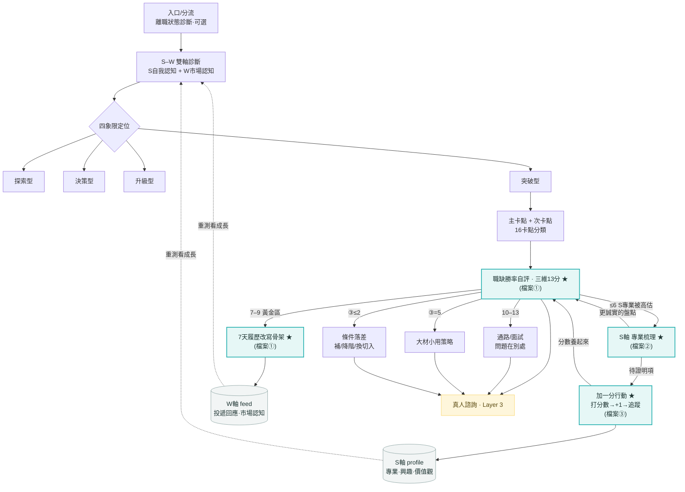

# 系統流程結構圖

> 兩層：核心引擎（通用，適用 16 卡點）＋ 已實作切片（突破型 B）。
> ★ 標記＝已建成的三支原型。GitHub 會自動把下方 Mermaid 渲染成流程圖。

## 已實作的三支原型

| 檔案 | 對應節點 |
|------|---------|
| `prototype-breakthrough-b-jobfit.html` | 職缺勝率自評（三維13分）＋ 五向分流 ＋ 7天履歷改寫骨架 |
| `prototype-s-axis-expertise.html` | S 軸·專業能力：專業梳理（兩個篩子 → 三類資產）＋ 舉證/補強行動 |
| `prototype-s-axis-values.html` | S 軸·價值觀：雙重排序（顯/潛意識）→ 落差洞察 → 打分數 |
| `prototype-plus-one-action.html` | 價值觀·加一分行動追蹤（打分數 1–10 → +1 → 追蹤） |

> S 軸三子維度：① 價值觀（values 原型 → 加一分行動）② 興趣（未建）③ 專業能力（expertise 原型 → 舉證/補強）。
> 決定 A：「加一分行動」為價值觀專屬；專業端用「舉證/補強行動」，不共用追蹤器。

## 流程圖

## 三條關鍵迴圈
1. **W→S→W 校正**：勝率 ≤6 → 專業梳理 → 重評勝率（雙軸互相校正）。
2. **養成迴圈**：待證明 → 加一分行動 → 分數養起來 → 回評勝率。
3. **Loop B 長期回補**：所有行動 → S/W profile → 重測 → 看成長（訂閱引擎）。
