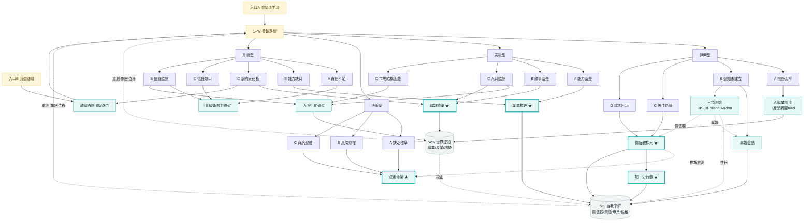

# 系統流程結構圖（完整版 · 16 卡點定稿）

> 反映定稿後的全貌：兩個入口 → S–W 診斷 → 四象限 16 卡點 → 工具 → 行動 → 雙迴圈回補。
> ★＝已建原型；其餘為待建/既有工具。詳細映射見 `master-map.md`。

## 已建原型 / 文件

| 檔案 | 角色 |
|------|------|
| `prototype-s-axis-values.html` ★ | 價值觀探索（雙重排序＋一致性/核心判讀） |
| `prototype-s-axis-assessments.html` ★ | 三項測驗（DISC性格／Holland興趣／Career Anchor價值觀）＋興趣盤點 |
| `prototype-plus-one-action.html` ★ | 價值觀加一分行動追蹤（1–10） |
| `prototype-s-axis-expertise.html` ★ | 專業梳理（兩個篩子→三類資產）＋舉證/補強 |
| `prototype-breakthrough-b-jobfit.html` ★ | 職缺勝率（三維13分）＋五向分流＋7天履歷改寫 |
| `prototype-decision-scaffold.html` ★ | 決策骨架（標準→權重→底線→重算） |
| `master-map.md` | 16卡點×工具×迴圈主關聯圖 |
| `measurement-model.md` | S%/W% 量表設計 |
| `s-axis-values-dimension.md` / `s-axis-assessments.md` | 價值觀維度 / 三項測驗 |

---

## 一、高層旅程（ASCII）

```
入口A 想釐清生涯 ─────────────┐
                              ▼
入口B 我想離職 → 離職診斷(6型路由) → S–W 雙軸診斷 → 四象限 → 主/次卡點 → 對應工具 → 行動
                                                                                  │
                                          ┌───────────────── 回補 ───────────────┘
                                          ▼
                    Loop B：工具產出 → S%(自我了解) / W%(世界認知) → 重測看象限位移
                    （真人諮詢＝全 16 卡點通用的加速/兜底層）
```

---

## 二、完整關係圖（16 卡點 → 工具）



> **真人諮詢**＝全部 16 卡點通用的加速/兜底層（想更快、或自助無效時），未畫線以免雜亂。
> **薪資談判**＝W 行動時間軸末站（成果兌現），接在突破型 offer 端與升級型加薪/跳槽之後。

---

## 三、工具庫 · 兩條軸線

- **S 軸 · 知己工具**（理解自己 → S%）：價值觀探索、興趣盤點、專業梳理、三項測驗（DISC/Holland/Career Anchor）
- **W 軸 · 行動工具**（沿求職時間軸 → W%）：**離職診斷（離開）→ 職缺勝率（投遞）→ 薪資談判（談薪/兌現）**；輔以 AI職業說明＋產業新聞feed
- **跨象限行動骨架**：決策骨架（決策A/B/C）、組織影響力骨架（升級A/D/E）、人脈行動骨架（突破C/D、探索A、升級D/E）、加一分行動（價值觀）、舉證/補強（專業）
- **通用層**：真人諮詢（全 16 卡點）

---

## 四、三條迴圈 ＋ 量表

1. **Loop A（縱深·短期）**：卡點 → 工具/骨架 → 完成。
2. **Loop B（回補·長期）**：工具產出 → S%（價值觀/興趣/專業/性格各25%）、W%（職業/產業/趨勢）→ 重測看成長與**象限位移** → 訂閱引擎。S 穩定、**W 會衰減**。
3. **W↔S 校正**：W 真實回報 ⇄ S 自評互校（突破勝率低→S專業；決策選不出→S價值觀）。

量表細節（含趨勢計分、衰減、回扣四象限）見 `measurement-model.md`。
